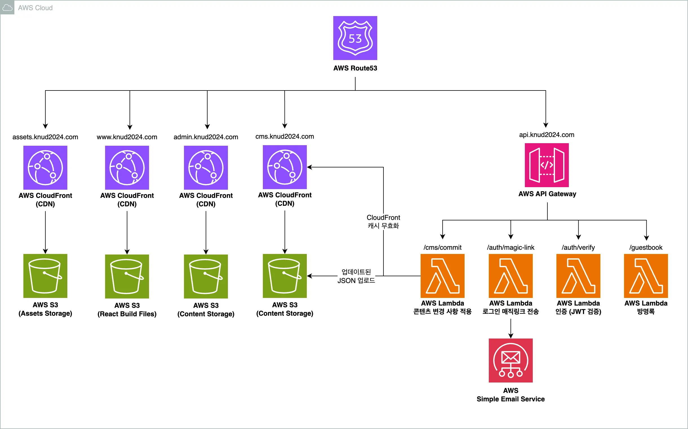

## 🎨 About

2024년 경북대학교 디자인학과 졸업전시 작품을 소개하는 웹사이트입니다  
전시 작품에 대한 정보, 작가 소개, 방명록, 그리고 아카이브된 사진첩 등의 기능을 제공합니다

## 🌏 Deployment, Repository Links

### Deployment Links

- 졸업전시회 사이트 : https://www.knud2024.com
- 컨텐츠 관리 시스템 (CMS) : https://admin.knud2024.com

### Repository Links

- Client Repository : https://github.com/KNU-Design-Web/knud2024-client
- Server Repository : https://github.com/KNU-Design-Web/knud2024-server
- CMS Repository : https://github.com/KNU-Design-Web/knud2024-cms

## 📐 Architecture

## ⚠️ Trouble Shooting

### 프로젝트 목록페이지 → 상세페이지 이동시 이미지 로드로 인한 성능병목 문제 개선

- 문제상황
    - 상세페이지 이미지 크기가 크고, 개수가 많아 페이지 전환시 Layout Shift 발생
    - Webp 이미지 특성상 Scanline 단위로 Incremental Decoding 되어 표시되며, 사용자에게 느린 로드 경험 제공
- 접근방법
    - Google Tag Manager 를 통해 목록페이지 → 상세페이지 이동시 목록페이지 `<article/>` 평균 hover 시간 측정
    - 목록페이지에서 `<article/>` hover 시, 상세페이지 헤더 및 상단 주요 이미지 prefetching
    - 상세페이지의 하단 이미지는 `Intersection Observer` 기반 Lazy Loading 적용
    - Offset 설정하여 뷰포트 진입 직전에 로드하여 UX 개선
- 성과
    - FCP : 4.1s → 2.8s
    - CLS : 0.214 → 0

### 이미지 무한 루프 슬라이더 (Marquee Effect) UX 개선

- 문제 상황
    - 아카이브 페이지에서 60개의 이미지가 위아래로 흐르며 루프되는 페이지 구현시
    - 총 60개의 이미지가 Scanline 단위로 Incremental Decoding 되어 표시되며, 사용자에게 느린 로드 경험 제공
- 접근 방법
    - Windowing 기법을 사용하여 현재 뷰포트에 보이기 직전 window 사이즈만큼 이미지를 로드
    - 나머지 이미지는 LazyLoad
- 성과
    - FCP : 3.1s → 1.5s

### 아코디언 라우팅 애니메이션 최적화

- 문제상황

    - 초기에는 아코디언 형태의 페이지 라우팅 애니메이션 구현시 모든 페이지 컴포넌트 마운트 후 `max-width` 속성을 조절하여 애니메이션을 처리
    - 이로 인해 화면에 보이지 않는 DOM 요소까지 마운트 되어, 불필요한 메모리 사용량이 증가

- 접근 방법

    - `react-transition-group` 을 사용해 페이지 전환 애니메이션을 구현
    - 애니메이션이 완료된 후, 보이지 않는 페이지 컴포넌트를 언마운트하도록 처리하여 메모리 최적화
    - QR 코드 및 URL 직접 접근 가능 요구사항을 고려해, SearchParams를 통해 상태 관리 방식으로 구현

- 성과
    - 브라우저 성능 탭 기준 JS Heap 메모리 사용량 50% 감소
    - 40,980,128 바이트 (약 40.98 MB) → 19,661,292 바이트 (약 19.66 MB)

### CMS 컨텐츠 관리 시스템 구현

- 문제상황
    - 졸업전시 참여 디자이너들의 작품 이미지, 프로필 정보, 방명록 수정이 필요하여 빈번한 데이터 갱신 필요
    - 일부 작품이미지의 경우 크기가 커 페이지 로드 성능 저하 및 리소스 낭비 발생
    - 또한 WebP/WebM 포맷으로 압축되지 않은 원본 이미지가 업로드되는 경우가 있어 최적화가 필요
- 접근 방법
    - 디자이너 작품 및 프로필 데이터를 관리하는 CMS 구축
    - CMS 에서 관리되는 데이터는 S3 에 JSON 형태로 저장하고, 이를 디자인학과 웹사이트의 React 번들보다 먼저 로드
    - 클라이언트에서는 window 전역 네임스페이스를 통해 데이터를 불러와 Loading Indicator 나 Skeleton UI 없이도 즉시 데이터 표시 가능
    - 대용량 이미지, 최적화된 포맷 문제 해결을 위해 CMS 업로드 시점에서 이미지 크기 최적화 로직 적용
- 성과
    - CMS 를 통한 디자이너-운영자 간 협업 프로세스 개선
    - 데이터 로드 속도 향상 및 사용자 경험 개선
    - 대용량 이미지로 인한 네트워크 병목 및 메모리 사용 문제 해결
